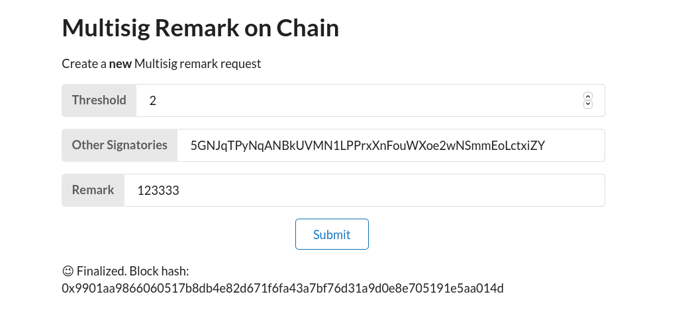
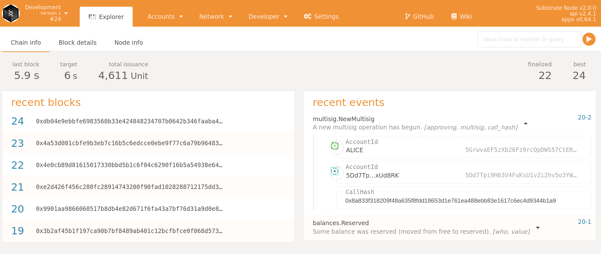
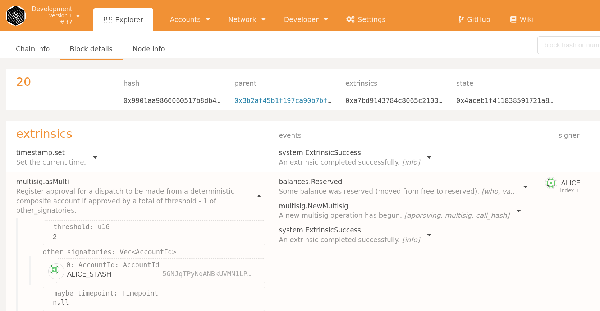

# Substrate Front End Template (with multisig remark UI component)

See commit history for the changes to the raw template
Note: the *raw runtime directory* modified from the node template is included to see the changes to required to `/runtime/src/lib.rs` and`/runtime/Cargo.toml` for using this frontend. 

See the `proof-pics` directory for a sample of how this works in action. 

## Proof of Completion:

### Using the component to submit a `multisig::as_multi` extrinsic



### Viewing the transaction via polkadot.js.org/apps



> And see it in the same block as from the template reported (check the hash)



## Usage

You can start the template in development mode to connect to a locally running node

```bash
yarn install
yarn start
```

You can also build the app in production mode,

```bash
yarn build
```
and open `build/index.html` in your favorite browser.

## Configuration

The template's configuration is stored in the `src/config` directory, with
`common.json` being loaded first, then the environment-specific json file,
and finally environment variables, with precedence.

* `development.json` affects the development environment
* `test.json` affects the test environment, triggered in `yarn test` command.
* `production.json` affects the production environment, triggered in
`yarn build` command.

Some environment variables are read and integrated in the template `config` object,
including:

* `REACT_APP_PROVIDER_SOCKET` overriding `config[PROVIDER_SOCKET]`
* `REACT_APP_DEVELOPMENT_KEYRING` overriding `config[DEVELOPMENT_KEYRING]`

More on [React environment variables](https://create-react-app.dev/docs/adding-custom-environment-variables).

When writing and deploying your own front end, you should configure:

* `CUSTOM_TYPES` in `src/config/common.json`. See
  [Extending types](https://polkadot.js.org/api/start/types.extend.html).
* `PROVIDER_SOCKET` in `src/config/production.json` pointing to your own
  deployed node.
* `DEVELOPMENT_KEYRING` in `src/config/common.json` be set to `false`.
  See [Keyring](https://polkadot.js.org/api/start/keyring.html).

### Specifying Connecting Node

There are two ways to specify it:

* With `PROVIDER_SOCKET` in `{common, development, production}.json`.
* With `rpc=<ws or wss connection>` query paramter after the URL. This overrides the above setting.

## Reusable Components

### useSubstrate Custom Hook

The custom hook `useSubstrate` provides access to the Polkadot js API and thus the
keyring and the blockchain itself. Specifically it exposes this API.

```js
{
  socket,
  types,
  keyring,
  keyringState,
  api,
  apiState,
}
```

- `socket` - The remote provider socket it is connecting to.
- `types` - The custom types used in the connected node.
- `keyring` - A keyring of accounts available to the user.
- `keyringState` - One of `"READY"` or `"ERROR"` states. `keyring` is valid
only when `keyringState === "READY"`.
- `api` - The remote api to the connected node.
- `apiState` - One of `"CONNECTING"`, `"READY"`, or `"ERROR"` states. `api` is valid
only when `apiState === "READY"`.


### TxButton Component

The [TxButton](./src/substrate-lib/components/TxButton.js) handles basic
[query](https://polkadot.js.org/api/start/api.query.html) and
[transaction](https://polkadot.js.org/api/start/api.tx.html) requests to the
connected node. You can reuse this component for a wide variety of queries and
transactions. See [src/Transfer.js](./src/Transfer.js) for a transaction example
and [src/ChainState.js](./src/ChainState.js) for a query example.

### Account Selector

The [Account Selector](./src/AccountSelector.js) provides the user with a unified way to
select their account from a keyring. If the Balances module is installed in the runtime,
it also displays the user's token balance. It is included in the template already.
